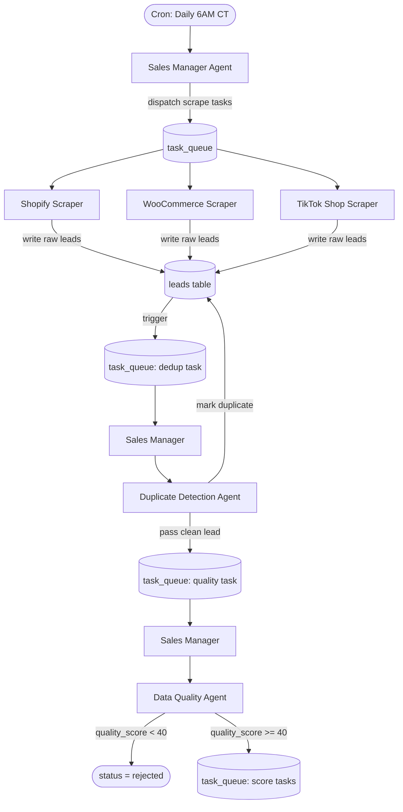
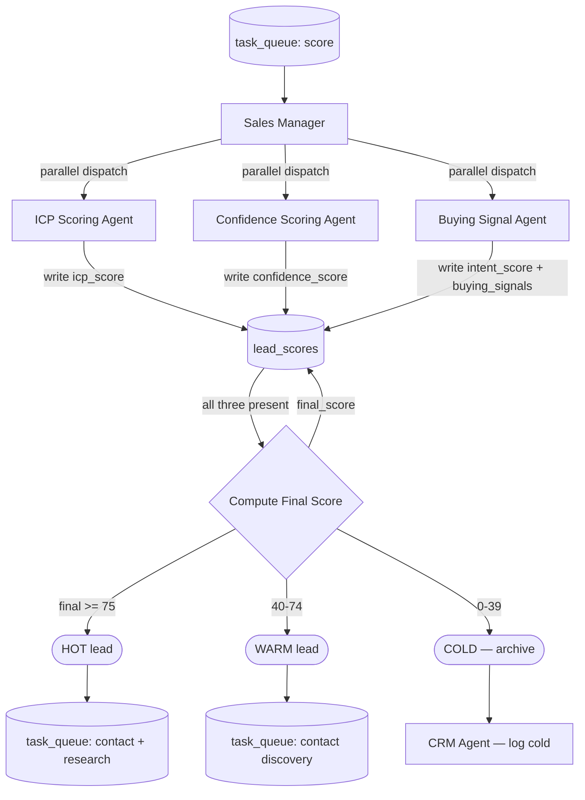
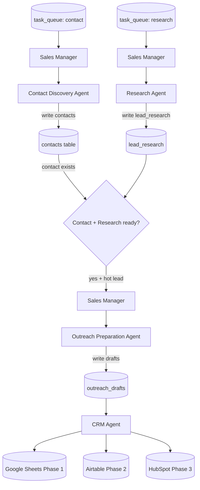
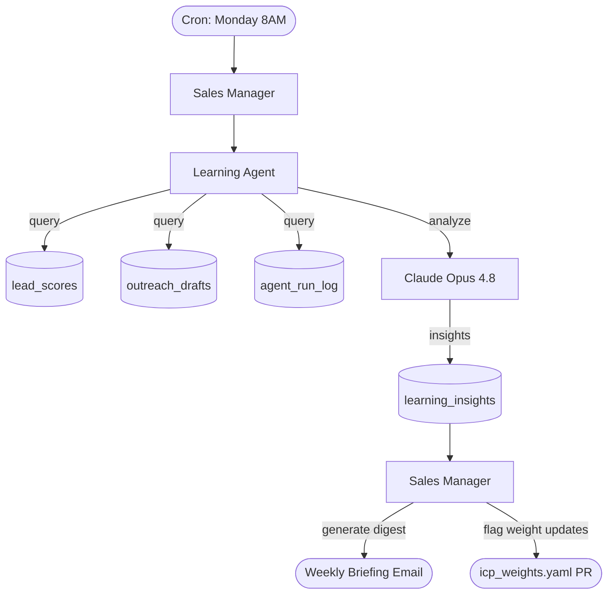

# Workflow Diagrams — AI Sales Department

All diagrams use Mermaid syntax. Render at mermaid.live or in any Markdown viewer.

---

## Workflow 1: Lead Ingestion Pipeline



---

## Workflow 2: Scoring Pipeline



---

## Workflow 3: Intelligence & Outreach Pipeline



---

## Workflow 4: Learning Loop (Weekly)



---

## Workflow 5: n8n Orchestration Map

```
n8n Workflows:
┌─────────────────────────────────────────────────────────┐
│  Workflow: Lead Ingestion                               │
│  Trigger: Schedule (daily)                             │
│  Steps:                                                 │
│    1. HTTP POST → FastAPI /api/v1/tasks/scrape          │
│    2. Wait for webhook callback (Apify done)           │
│    3. HTTP POST → FastAPI /api/v1/tasks/dedup           │
│    4. Notify Slack: "X new leads ingested"             │
└─────────────────────────────────────────────────────────┘

┌─────────────────────────────────────────────────────────┐
│  Workflow: Scoring Pipeline                             │
│  Trigger: Webhook from API (new clean lead)            │
│  Steps:                                                 │
│    1. HTTP POST → /api/v1/tasks/score                   │
│    2. Poll /api/v1/leads/{id}/scores until complete    │
│    3. Branch: Hot → contact workflow                   │
│    4. Branch: Warm → contact-only workflow             │
│    5. Branch: Cold → archive + notify                  │
└─────────────────────────────────────────────────────────┘

┌─────────────────────────────────────────────────────────┐
│  Workflow: CRM Sync                                     │
│  Trigger: Webhook (lead status change)                 │
│  Steps:                                                 │
│    1. Append row to Google Sheets (Phase 1)            │
│    2. Create/update Airtable record (Phase 2)          │
│    3. Create HubSpot contact+company (Phase 3)         │
│    4. Log to crm_sync_log via API                      │
└─────────────────────────────────────────────────────────┘

┌─────────────────────────────────────────────────────────┐
│  Workflow: Weekly Learning Loop                         │
│  Trigger: Schedule (Monday 8AM CT)                     │
│  Steps:                                                 │
│    1. POST → /api/v1/tasks/learn                        │
│    2. Fetch insights from /api/v1/insights/latest      │
│    3. Format + send email digest to sales team         │
└─────────────────────────────────────────────────────────┘
```
